# Документация к нейросети

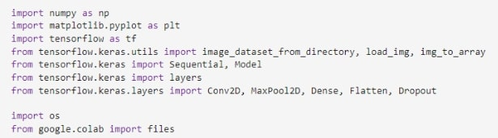

Код импортирует необходимые библиотеки для работы с нейросетью:

- numpy - библиотека для работы с массивами и матрицами;
- matplotlib - библиотека для визуализации данных и графиков;
- tensorflow - фреймворк для работы с нейросетями;
- image_dataset_from_directory, load_img, img_to_array - функции из tensorflow.keras.utils для работы с изображениями;
- Sequential, Model, layers, Conv2D, MaxPool2D, Dense, Flatten, Dropout, reshape - классы и функции из tensorflow.keras.layers для определения архитектуры нейросети;
- os - модуль для работы с операционной системой;
- google.colab - модуль для работы с Google Colaboratory.

Также, код предполагает использование изображений из определенной директории. Функции image_dataset_from_directory, load_img и img_to_array используются для загрузки и преобразования изображений в формат, пригодный для обучения нейросети.

## 1. Загружаем данные
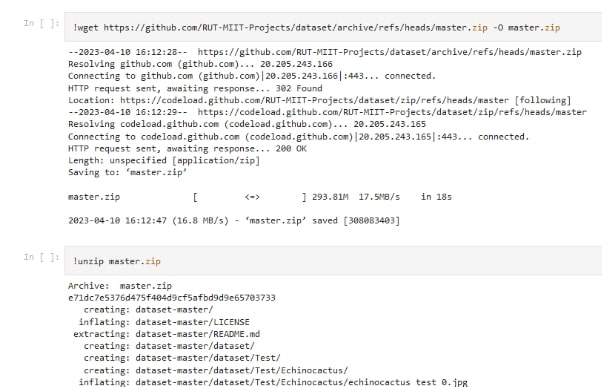

Этот код загружает набор данных изображений, необходимый для обучения нейросети.

- wget - команда для загрузки файла по ссылке;
- ! - знак восклицания используется в Jupyter Notebook или Google Colab для запуска команд операционной системы из ячейки кода;
- https://github.com/RUT-MIIT-Projects/dataset/archive/refs/heads/master.zip - ссылка на архив с данными;
- -O master.zip - параметр команды wget для сохранения файла под указанным именем;
- unzip - команда для распаковки архива;
- master.zip - имя архива, который нужно распаковать.

Таким образом, код загружает набор данных изображений в виде архива master.zip и распаковывает его.

## 2. Создаем Tensorflow Dataset'ы
Данные разбиты на 3 выборки: **обучающую, проверочную, тестовую(данные, которые нейронка "не видела").**

**Обучающая выборка** (training set) - набор данных, который используется для обучения сети.

**Проверочная выборка** (validation set) - набор данных, который используется в процессе обучения для подбора гиперпараметров сети.

**Тестовая выборка** (test set) - набор данных, который используется для оценки качества работы сети после завершения обучения.

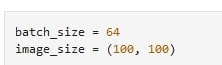

**Набор данных для обучения**

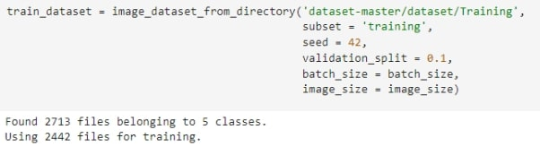

Этот код создает обучающий набор данных изображений.

- batch_size = 64 - количество изображений в одной партии;
- image_size = (100, 100) - размер изображений в пикселях, которые будут использоваться для обучения;
- image_dataset_from_directory - функция TensorFlow для загрузки набора данных изображений;
- 'dataset-master/dataset/Training' - путь к папке, где хранятся обучающие изображения;
- subset='training' - указывает, что будет создан набор данных для обучения;
- seed=42 - задает начальное значение для генератора случайных чисел, чтобы исключить "случайные" перестановки каждый раз при запуске image_dataset_from_directory;
- validation_split = 0.1 - указывает, какую часть данных следует выделить для проверки модели;
- batch_size = batch_size - устанавливает размер пакета для обучения нейросети;
- image_size = image_size - устанавливает размер изображений.

Функция image_dataset_from_directory возвращает объект tf.data.Dataset, который содержит обучающие данные. Количество файлов, найденных в папке 'dataset-master/dataset/Training', равно 2713. Из них 2442 файлов будут использованы для обучения, а 271 файл будет отложен для проверки модели.

**Проверочный набор данных**

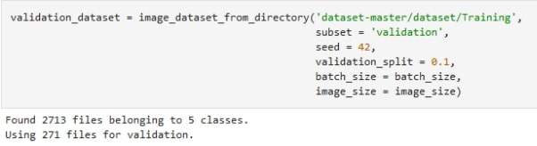

Этот код создает проверочный набор данных изображений.

- 'dataset-master/dataset/Training' - путь к папке, где хранятся обучающие изображения;
- subset = 'validation' - указывает, что будет создан набор данных для проверки;
- seed = 42 - задает начальное значение для генератора случайных чисел, чтобы исключить "случайные" перестановки каждый раз при запуске image\_dataset\_from\_directory;
- validation_split = 0.1 - указывает, какая часть выделена для проверки модели;
- batch_size = batch_size - устанавливает размер пакета для проверки нейросети;
- image_size = image_size - устанавливает размер изображений.

Функция image_dataset_from_directory возвращает объект tf.data.Dataset, который содержит данные для проверки модели. Количество файлов, найденных в папке 'dataset-master/dataset/Training', равно 2713. Из них 2442 файлов будут использованы для обучения, а 271 файл будет отложен для проверки модели.

**Названия классов в наборах данных**

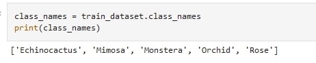

- class_names - это список, который содержит имена классов в том порядке, в котором они были обнаружены в директории, в которой расположены обучающие изображения.

В данном случае список содержит имена пяти классов: "Echinocactus", "Mimosa", "Monstera", "Orchid" и "Rose". Эти имена соответствуют названиям подпапок в папке 'dataset-master/dataset/Training'.

**Примеры изображений**

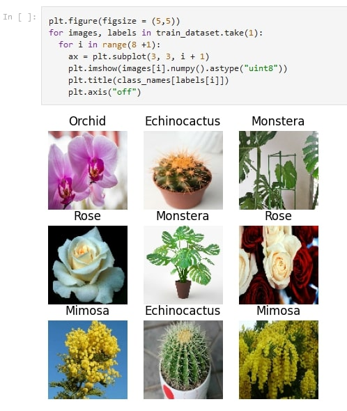

Этот код строит графическое представление изображений, используемых для обучения модели.

- plt.figure(figsize = (5,5)) - создает объект figure библиотеки matplotlib, определяющий размеры рисунка.
- train_dataset.take(1) - возвращает набор данных для обучения (тренировочный) размером 1 пакет, то есть изображения и соответствующие им метки (классы).
- for images, labels in train_dataset.take(1)): - проходится по набору данных для обучения. На каждом шаге цикла в images и labels сохраняются изображения и соответствующие им метки (классы).
- for i in range(8 + 1): - цикл, который пройдется по 9 изображениям в пакете.
- ax = plt.subplot(3, 3, i + 1) - создает объект axes, который является графическим представлением отдельного изображения. В данном случае используется сетка из 3х3 ячеек, и на каждой итерации цикла создается объект axes в следующей ячейке.
- plt.imshow(images[i].numpy().astype("uint8")) - отображает i-ое изображение из пакета на графике. images[i] возвращает i-ое изображение в пакете, а .numpy() преобразует его в массив NumPy, а .astype("uint8") конвертирует его в беззнаковый 8-битный тип данных (unsigned 8-bit integer).
- plt.title(class_names[labels[i]]) - задает заголовок графического представления i-ого изображения, используя соответствующую метку (класс) class_names[labels[i]].
- plt.axis("off") - скрывает оси координат на графике.

**Набор данных для тестирования**

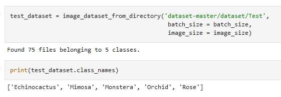

Код загружает наборы данных изображений с помощью функции image_dataset_from_directory в TensorFlow.

Для тестового набора данных загружаются изображения из каталога dataset-master/dataset/Test с размером партии 64 и размером изображения 100 x 100 пикселей. Для тестирования используется 75 файлов.

Список class_names содержит названия пяти классов изображений в наборе данных: 'Echinocactus', 'Mimosa', 'Monstera', 'Orchid' и 'Rose'.

## 3. Создаем нейронную сеть
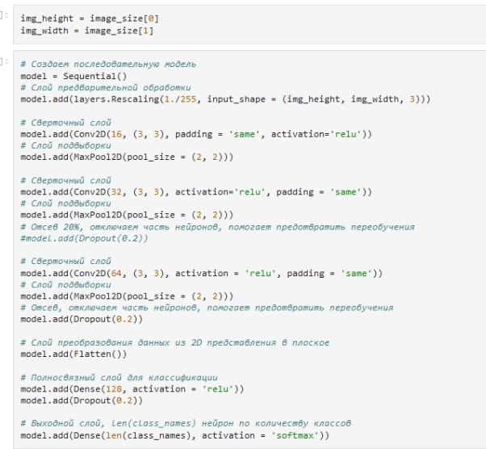

Этот код создает модель нейронной сети для распознавания изображений.

Переменные img_height и img_width устанавливают высоту и ширину изображения, а также model - создает объект модели нейронной сети типа Sequential.

model.add добавляет последовательно слои к модели.

Первый слой Rescaling масштабирует значения пикселей изображения в диапазоне от 0 до 1, чтобы ускорить обучение модели.

Затем следует несколько сверточных слоев Conv2D, каждый со своим ядром и функцией активации ReLU. MaxPool2D добавляет слой пулинга, который уменьшает размерность выходного изображения.

Следующие слои Dropout случайным образом отключают часть нейронов, чтобы уменьшить переобучение модели.

Слои Flatten преобразует двумерный вывод из слоя MaxPool2D в одномерный вектор.

Затем следует полносвязный слои Dense, где каждый нейрон соединен с каждым нейроном следующего слоя.

Последний слой Dense имеет размер, равный количеству классов, и использует функцию активации softmax, чтобы определить вероятность принадлежности изображения к каждому классу.

**Печатаем информацию о сети**

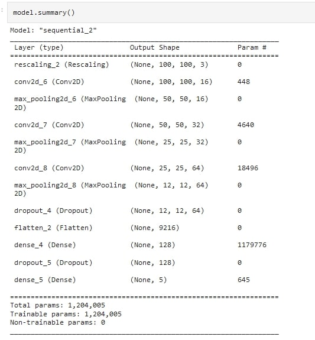

Это сводка модели, которая показывает ее архитектуру и количество параметров, которые нужно обучить.

- Входной слой (rescaling_2) изменяет масштаб изображения, чтобы значения пикселей находились в диапазоне [0, 1].
- Затем идет три сверточных слоя (conv2d_6, conv2d_7, conv2d_8), каждый из которых использует ядро размером 3x3 и ReLU в качестве функции активации. Первый сверточный слой имеет 16 фильтров, второй - 32 фильтра, а третий - 64 фильтра. Слой padding = 'same' используется для сохранения размера изображения в сверточном слое.
- Между ними идут три слоя пулинга (max_pooling2d_6, max_pooling2d_7, max_pooling2d_8), каждый из которых использует пулинг размером 2x2. После каждого слоя свертки применяется слой пулинга для уменьшения размерности изображения.
- Затем идет слой Dropout с коэффициентом отсечения 0,2, чтобы предотвратить переобучение модели.
- Затем Flatten слой, который преобразует многомерный тензор в одномерный тензор.
- Затем два полносвязных слоя (dense_4 и dense_5). Первый слой имеет 128 нейронов и использует ReLU в качестве функции активации, второй - 5 нейронов (по числу классов) и использует функцию активации softmax, чтобы определить вероятности каждого класса.

Общее количество обучаемых параметров модели составляет 1 204 005.

**Компилируем модель**

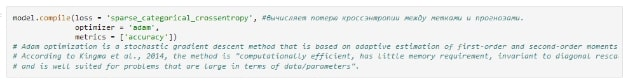

Эта строка компилирует модель, используя оптимизатор 'adam', функцию потерь 'sparse_categorical_crossentropy' и метрику 'accuracy' для оценки производительности модели во время обучения. 

Функция потерь 'sparse_categorical_crossentropy' используется, когда метки имеются в виде целых чисел, а не в виде векторов, и когда число классов больше двух. 

Оптимизатор 'adam' используется для обновления весов модели во время обучения. 

Метрика 'accuracy' используется для оценки точности модели во время обучения.

## 4. Обучаем нейронную сеть
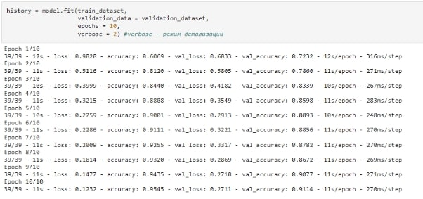

Модель состоит из нескольких конволюционных и объединяющих слоев, за которыми следуют два полностью связанных слоя. Точность обучения и проверки постепенно улучшается с каждой эпохой, что указывает на то, что модель учится классифицировать изображения более точно с течением времени. После десяти эпох точность обучения составила 95,45%, а точность проверки - 91,14%.

## 5. Качество обучения сети
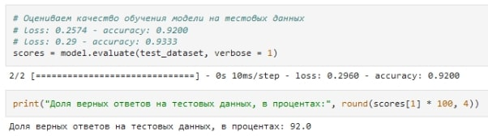

**На проверочных данных при обучении:**

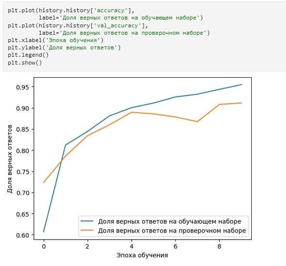

Код создает график, на котором по оси x отображаются эпохи, а по оси y - точность модели на обучающих данных (синяя линия) и точность модели на проверочных данных (оранжевая линия).

График accuracy показывает, как точность модели меняется в процессе обучения на обучающем и проверочном наборах данных. Если кривые движутся близко друг к другу, это может указывать на отсутствие переобучения (overfitting) модели. Если точность на обучающем наборе значительно выше, чем на проверочном, то это может указывать на переобучение.

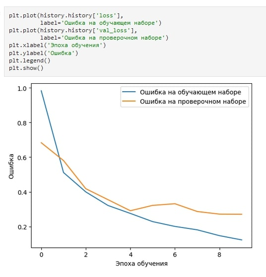

- График ошибки показывает, как изменяется потеря (ошибка) модели в процессе обучения на обучающем и проверочном наборах данных. Если кривые движутся близко друг к другу, это может указывать на отсутствие переобучения. Если ошибка на обучающем наборе значительно ниже, чем на проверочном, то это может указывать на переобучение.

Оба графика помогают оценить качество обучения модели.

## 6. Сохраняем обученную нейронную сеть
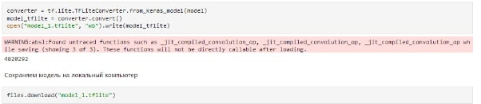

Этот код конвертирует модель в формат TFLite и сохраняет ее в файл "model_1.tflite".

Код from_keras_model используется для создания конвертера из модели Keras. Затем метод convert() используется для конвертации модели в TFLite формат. Конвертированная модель сохраняется в файл "model_1.tflite" с помощью функции open() и метода write().

Код files.download() не относится к Python, он используется только в Jupyter Notebook или Google Colab для загрузки файлов. Он загружает файл "model_1.tflite" на компьютер пользователя.

## 7. Проверка сети на своих данных
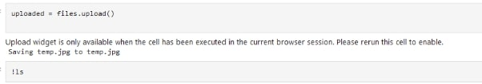

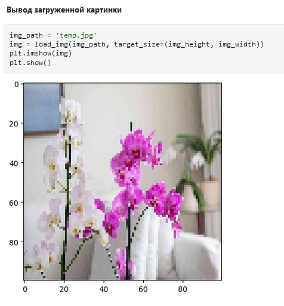

Этот код загружает изображение, изменяет его размер до размеров, определенных ранее, и выводит изображение с помощью библиотеки Matplotlib.

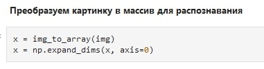

Данный код преобразует изображение в формат массива numpy и добавляет дополнительное измерение для создания батча (batch), то есть для подачи изображения на вход модели. Каждый элемент этого батча будет представлять собой изображение, заданное в виде трехмерного массива (высота, ширина, количество каналов).

Конкретно в данном случае, первая строка кода преобразует изображение в массив numpy, где каждый пиксель изображения будет представлен в виде трех значений RGB. Вторая строка добавляет дополнительное измерение в начале массива, чтобы получить одноэлементный батч.

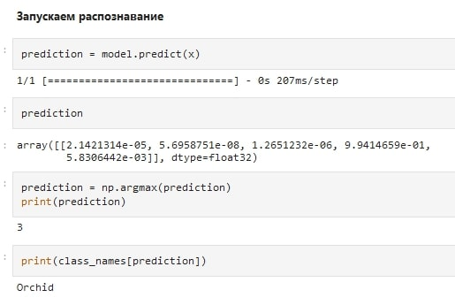

